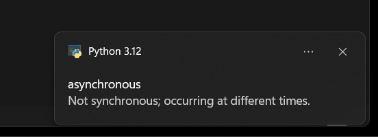

 # Word-Dictionary
- A Python Code That Will Push Notifications of Random Words With its Meaning

    _Help in Vocabulary_

## How To Use
 
>  Download the Package

* Run :
click `Dictionary.bat`
or In Shell
`python3 Word.py`
 
## Configure

>[!IMPORTANT]
>  Enable Notifications In Settings .

>[!NOTE]
> You can set the time of each notification duration by changing `time.sleep(x)`.
> for Duration ` duration =x` .

### How it works: :

## Credits :
***RESOURCES USED:***

- [API](https://api.dictionaryapi.dev) > free api
- [DICTIONARY](https://svnweb.freebsd.org/csrg/share/dict/words?view=co&content-type=text/plain)

:+1:  ***HOPE YOU LIKE IT***